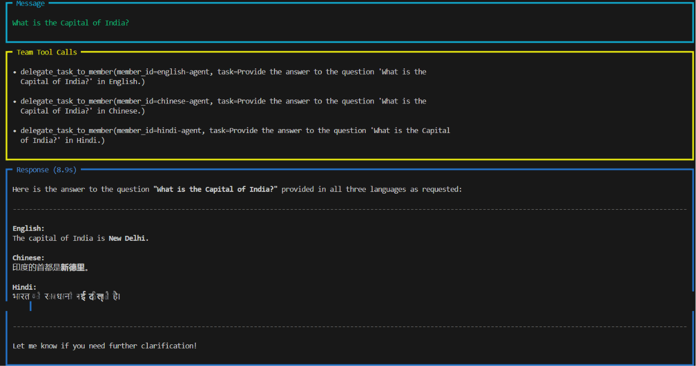
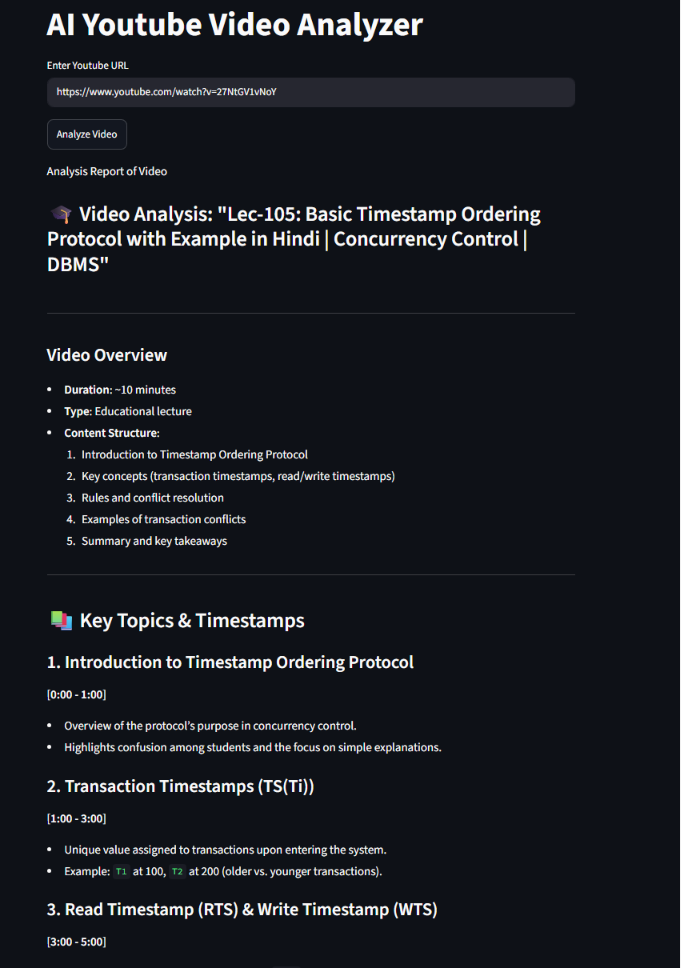
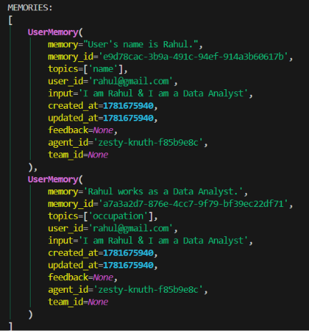

<div align="center">


<br/>

[](https://python.org)
[](#)
[](#)
[](https://streamlit.io)
[](#)

<br/><br/>

> ### *"Stop calling APIs. Start building intelligent systems."*

</div>

---

# 🧠 AgentMesh — System Architecture

<div align="center">



</div>

AgentMesh is a **multi-agent AI system** where multiple intelligent agents collaborate, use tools, and retain memory to solve problems like a real system — not a single API call.

---

# ⚡ What Makes This Different

| Feature   | Typical AI Apps | AgentMesh       |
| --------- | --------------- | --------------- |
| Memory    | ❌ None          | ✅ Persistent    |
| Agents    | ❌ Single        | ✅ Multi-agent   |
| Tools     | ❌ Limited       | ✅ Integrated    |
| Reasoning | ❌ Stateless     | ✅ Context-aware |

---

# 🎥 YouTube Intelligence System

<div align="center">



</div>

### Capabilities:

* Breaks down any YouTube video
* Generates timestamps
* Extracts structured insights
* Identifies key concepts

---

# 🧠 Memory Engine (CORE DIFFERENTIATOR)

<div align="center">



</div>

### What it enables:

* User identity tracking
* Context-aware responses
* Long-term interaction memory

---

# 🤝 Multi-Agent Flow

```text
User Query
   │
   ▼
Agent Orchestrator
   │
 ┌─┴───────────────┐
 ▼                 ▼
English Agent   Hindi Agent   Chinese Agent
   │                 │              │
   └──────┬──────────┴──────┬───────┘
          ▼                 ▼
     Tools Layer       Memory Layer
          │                 │
          └─────────┬───────┘
                    ▼
             Final Response
```

---

# 🧩 Project Structure

```bash
AgentMesh/
│
├── app/
│   ├── agents/
│   ├── ui/
│   └── db/
│
├── assets/
│   ├── Agentic_Team.png
│   ├── Youtube_analyzer.png
│   └── memory_with_agenticAI.png
│
├── requirements.txt
└── README.md
```

---

# 🚀 Quick Start

```bash
git clone https://github.com/your-username/AgentMesh.git
cd AgentMesh
pip install -r requirements.txt
```

Create `.env`:

```env
GROQ_API_KEY=your_api_key_here
```

Run:

```bash
streamlit run app/ui/streamlit_app.py
```

---

# 🧠 Why This Project Matters

Most AI projects:

* Just call an API
* No memory
* No structure

AgentMesh:

* ✔ Multi-agent reasoning
* ✔ Memory-aware system
* ✔ Tool integration
* ✔ Real-world application

---

# 📈 Roadmap

* Autonomous agent planning
* Tool chaining pipelines
* Vector database (RAG memory)
* Multi-modal agents

---

# 🧑‍💻 Author

**Abhay Kumar**
Building intelligent systems with agents, memory, and real-world AI applications

---

<div align="center">

⭐ Star this repo if you believe AI should **think in systems, not just responses**

</div>
